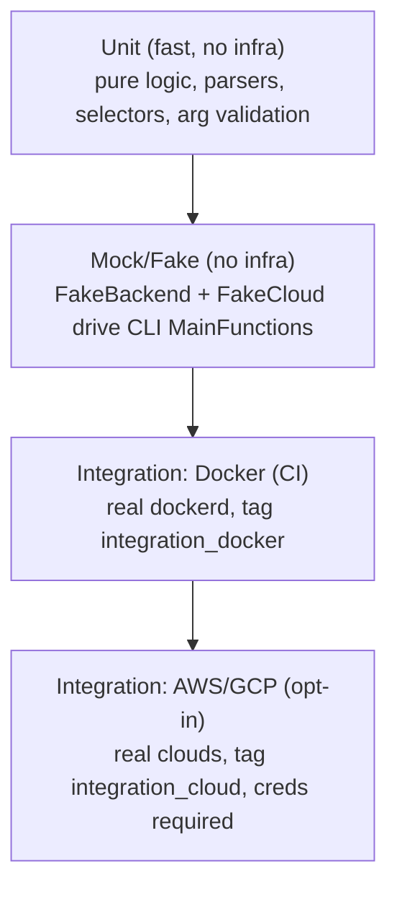

# Aerolab v8 Testing Revamp

## Goal

Move from "no CI + ad-hoc `go test` + a giant bash `test.sh`" to a clean, layered, CI-enforced test suite. Maximize automated coverage via unit tests and mocks; keep only genuinely-infra-dependent behavior in gated integration tests; delete the bash test scripts once ported.

This plan is written to be executed by a fresh agent with no prior context. Follow the phases in order. Each phase lists exact files, signatures, snippets, and acceptance criteria.

Scope decisions (already confirmed with the user):
- Moderate production refactoring only: cheap, low-risk seams. Mock primarily at the existing `backends.Backend` / `backends.Cloud` interfaces and around extracted pure functions. Do NOT rewrite `sshexec` or the cloud SDK clients behind new interfaces.
- Cloud strategy: mocked/pure-logic unit tests for AWS/GCP provider logic + real-Docker integration tests in CI + real AWS/GCP kept as an opt-in, env-gated integration suite.

## Repo orientation (read first)

- Go module root: `/Users/rglonek/Code/aerolab/src` (module `github.com/citrusleaf/aerolab`, Go 1.26.4). `cli/`, `pkg/`, and `tests/` are all **sibling directories directly under this single module** (there is no separate `cli` module) - `pkg/...` and `tests/...` are NOT reachable via `go test ./...` run from inside `cli/`. Any test target must run from the `src` root (or explicitly list `./cli/... ./pkg/... ./tests/...`) to cover the whole codebase. The one exception is `pkg/expiry/gcp`, which has its own nested `go.mod` (also listed in the root `go.work`) and is therefore automatically excluded from a root-level `./...` - that's intentional, its GCP Cloud Function is out of unit-test scope (see Phase 6). There is a root `go.work`; the build uses `GOWORK=off GOFLAGS=-mod=vendor` (see `src/Makefile` lines 12-13). All `go test` invocations must mirror this or they will try to hit the network / use go.work.
- Vendored deps live in `src/vendor`. `testify` (`github.com/stretchr/testify v1.11.1`) is already vendored.
- Run all `go` commands from `/Users/rglonek/Code/aerolab/src` unless noted.
- Build tags already in use: `noagi`, `noaerolabmcp`, `noaws`, `nogcp`, `nodocker`. Do not break these.

Key files/dirs:
- Backend interfaces: `src/pkg/backend/backends/backendInventories.go` (`Cloud` iface lines 69-158, `Backend` iface lines 160-217).
- Backend registry (global singleton): `src/pkg/backend/backends/backend.go` (`cloudList` map + `RegisterBackend`).
- Inventory selectors/actions: `src/pkg/backend/backends/{instances,volumes,firewalls,images,networks}.go`. `InstanceList.Exec` (instances.go ~600-614) fans out over the global `cloudList`, NOT the injected `Backend`.
- Backend constructor: `src/pkg/backend/init.go` -> `backends.InternalNew(...)`.
- Providers: `src/pkg/backend/clouds/baws/*.go`, `.../bgcp/*.go`, `.../bdocker/*.go`.
- CLI init / service-locator: `src/cli/cmd/v1/initialize.go` (`System` struct lines 54-79, `Init` struct lines 81-89, `Initialize()` line 106, backend-wiring method `func (i *Init) backend(s *System, pollInventoryHourly bool) error` line 375, `backend.New(...)` call line 470).
- CLI command pattern doc: `src/cli/cmd/v1/README.md`. Every command has `Execute(args)` -> `Initialize(...)` -> a `MainFunction(system, inventory, logger, args, action)`.

## Current State (findings)

- No CI runs tests. Only `.github/workflows/create-prerelease.yml` + `send-mail.yml`; `make check` (src/Makefile 142-151) is lint-only (`go vet`, `go fix`, `golangci-lint`) and scoped to `cli/`. No `test` target anywhere.
- Good unit coverage: `src/pkg/agi/*` (~29 files: db, ingest, plugin), `src/pkg/mcp/*` (~10 files). Light: `src/pkg/sshexec/dialer_test.go` (4 tests), `src/pkg/backend/clouds/bgcp/disks_test.go` + `.../bgcp/iap/dialer_test.go`, `src/pkg/utils/installers/aerospike/jfrog/*` (4 files). Zero unit tests: `backend/backends`, `backend/clouds/baws`, `backend/clouds/bdocker`, `conf`, `eks`, `expiry`, `webui`, `termutil`, and nearly all `utils/*`. Only 4 of ~250 CLI command files have tests (`cmdMcp_test.go`, `simplemode_mcp_test.go`, `cmdAgiQuery_test.go`, `cmdAgiCreate_pebble_test.go`).
- No mocking framework. Ad-hoc `httptest`, inline stubs (e.g. `stubSimpleModeGate`), `t.TempDir()`. No `testdata/`/`fixtures/` dirs committed.
- E2E is bash: `src/tests/cli/test.sh` (+ `build.sh`, `cleanup.sh`, `test-migrate.sh`, `test-cloud-manual.sh`, `tests-to-add.sh`) builds a real `aerolab` binary and drives it against real Docker/AWS/GCP. Hardcoded, non-portable values: features path `/Users/rglonek/aerolab/features/`, GCP project `aerolab-test-project-1`, GCP region `us-central1`, AWS region `us-east-1` profile `eks`, VPC `vpc-090bcfc952f522c85` (in `testcloud`), SSH keys `/Users/rglonek/aerolab-keys` (migrate).
- Go integration: `src/tests/backend/*_test.go` (package `backend_test`) calls `backend.New()` against live clouds, env-gated by `AEROLAB_CLOUD` (+ `AWS_PROFILE`/`GCP_PROJECT`, `AEROLAB_<CLOUD>_TEST_REGIONS`, `AEROLAB_SKIP_CLEANUP`, `AEROLAB_TEST_CUSTOM_TMPDIR`). See `src/tests/backend/setup_test.go` and `src/tests/backend/readme.txt`. These have NO build tag today, so they compile in the default build but skip without env.
- `src/tests/installers/*` (aerolab, aerospike, compilers, easytc, eksctl, goproxy, grafana, prometheus, vscode) are Go tests that generate an install script, `docker run` an OS image, exec it inside, and hit real download endpoints. No build tag today.

## Seams available for mocking

- `backends.Backend` and `backends.Cloud` are clean, complete interfaces. A hand-written fake is straightforward (large but mechanical).
- Gotcha #1: inventory list actions (`InstanceList.Exec`, `.Terminate`, `.Stop`, `.Start`, `VolumeList.*`, etc.) dispatch through the package-global `cloudList` via `ListBackendTypes()`, not through the injected `Backend`. To exercise those in a unit test you must `RegisterBackend(BackendType("..."), fakeCloud)` and give your fixture instances that `BackendType`. `cloudList` is global -> such tests must run serially and clean up their registration.
- Gotcha #2: `CreateInstances/CreateVolume/CreateFirewall/Expiry*` on the `Backend` facade route through `b.enabledBackends[type]` (per-instance), so mocking the `Backend` interface alone is enough for those.
- Seam to add (only production change): `Init.BackendOverride backends.Backend` so command `MainFunction`s can be driven through the normal `Initialize` path with a fake. Details in Phase 3.
- Gotcha #3: `Initialize()` (initialize.go:106) has real-filesystem side effects independent of the backend: it resolves `AerolabRootDir()` (honors `AEROLAB_HOME` override - see `cli/cmd/v1/aerolabRootDir_{linux,darwin,windows}.go`), creates a real config dir + ini file + `v8` marker file, and calls `TelemetrySend()` **synchronously**, which does `os.MkdirAll` on `<home>/telemetry` before it even checks `AEROLAB_TELEMETRY_DISABLE` (telemetry.go:67-92). Any test that calls `Initialize()` - even ones only injecting `BackendOverride` - MUST set `AEROLAB_HOME` to a per-test temp dir and `AEROLAB_TELEMETRY_DISABLE=1` first, or it will read/write the real developer's or CI runner's home config directory. This must be a mandatory helper in the Phase 2 test-support package (`t.Setenv` both vars), not something each of the ~50 command tests re-implements ad hoc.

## Test Taxonomy (target)



Build-tag scheme (new):
- Default `go test ./...` (no tags) = unit + mock only. Fast, hermetic, race-enabled, runs on every PR.
- `//go:build integration_docker` = tests needing a real Docker daemon (CI-runnable on ubuntu runners).
- `//go:build integration_cloud` = tests needing real AWS/GCP credentials (manual `workflow_dispatch` only, never blocks PRs).
- Keep existing `noagi`/`noaerolabmcp`/`noaws`/`nogcp`/`nodocker` working.

---

## Phase 1 - Foundation: Makefile + CI + tagging

Files: `src/Makefile` (edit), new `.github/workflows/test.yml`.

1. Add Makefile targets (mirror existing env: `GOWORK=off`, `GOFLAGS=-mod=vendor`). Run from the `src` module root (NOT `cd cli`) so `./...` covers `cli/`, `pkg/`, and `tests/` together - `pkg/` and `tests/` are siblings of `cli/`, not descendants, so a `cd cli && go test ./...` style target would silently skip almost everything Phases 2/4/6/7 add. Suggested (these targets live in `src/Makefile`, so `.` below is already `src/`):

```make
.PHONY: test
test:
	go test -mod=vendor -race -shuffle=on -timeout=10m ./...

.PHONY: test-cover
test-cover:
	go test -mod=vendor -race -coverprofile=coverage.out -covermode=atomic ./...
	go tool cover -func=coverage.out | tail -n1

.PHONY: test-docker
test-docker:
	go test -mod=vendor -tags=integration_docker -timeout=60m ./...

.PHONY: test-cloud
test-cloud:
	go test -mod=vendor -tags=integration_cloud -timeout=180m ./...
```

Notes:
- Verified: module root is `src` (single `go.mod`); `cli/`, `pkg/`, `tests/` are sibling directories under it, so `./...` from `src` reaches all three in one invocation. `pkg/expiry/gcp` has its own nested `go.mod` and is correctly excluded automatically - no special-casing needed. Confirm with `cd src && GOWORK=off GOFLAGS=-mod=vendor go list ./...` that the expected package count includes `cli/...`, `pkg/...`, and `tests/...` entries before finalizing.
- Because these targets no longer `cd`, running `make -C src test` (or `make test` from within `src/`) is required; if invoked from the repo root, add `-C src` or a thin wrapper target there.
- Ensure `-race` works with cgo disabled builds; the build uses `CGO_ENABLED=0` for release but `-race` needs cgo. Run tests with default cgo (do NOT set `CGO_ENABLED=0` in the test target).

2. Create `.github/workflows/test.yml` triggered on `pull_request` and `push`:
   - Job `lint`: setup Go 1.26.4, `golangci-lint run ./...` (in `src/cli`).
   - Job `unit`: setup Go, `make -C src test` (unit + mock, race).
   - Job `docker-integration`: ubuntu-latest (Docker preinstalled), `make -C src test-docker`. Allow-fail initially is optional; prefer required once green.
   - Do NOT add cloud or installer suites to PR CI. Add a separate `workflow_dispatch` job `cloud-integration` gated behind repo secrets for later manual runs.

3. Acceptance: `make -C src test` runs and passes locally with no cloud creds and no Docker; a deliberately-broken test placed under `src/pkg/...` (not just `src/cli/...`) is detected by `make -C src test`, proving the target isn't silently scoped to `cli/` only; `test.yml` shows lint + unit jobs on a PR.

---

## Phase 2 - Shared test-support package

New package: `src/pkg/backend/backendtest/` (importable by both `pkg/...` and `cli/...` tests; avoid `internal/` so CLI tests in a different dir tree can import it). Files:

- `fakecloud.go` - `FakeCloud` implementing every method of `backends.Cloud` (69-158 in backendInventories.go). Design:
  - Struct holds programmable return values and a call log: e.g. `type FakeCloud struct { Instances backends.InstanceList; Volumes backends.VolumeList; Images backends.ImageList; Networks backends.NetworkList; Firewalls backends.FirewallList; ExecFunc func(backends.InstanceList, *backends.ExecInput) []*backends.ExecOutput; Calls []Call; Errs map[string]error }`.
  - Default every method to record the call and return zero-value + `Errs[name]` (nil if unset). Getters return the canned lists. This keeps the fake usable even as the interface grows.
  - Provide `func (f *FakeCloud) Reset()`.
- `fakebackend.go` - `FakeBackend` implementing every method of `backends.Backend` (160-217). Backed by an in-memory `*backends.Inventory` you can seed; `GetInventory()` returns it; `Create*` append to it and record calls; `Expiry*`/VPC/pricing return canned values or `Errs[name]`.
- `fixtures.go` - builders for synthetic inventory objects, e.g. `NewInstance(clusterName string, nodeNo int, opts...)`, `NewInventory(instances ...*backends.Instance)`, `NewVolume(...)`. Inspect the concrete structs in `backends/instances.go`, `volumes.go`, `images.go`, `networks.go`, `firewalls.go` for required fields (BackendType, ClusterName, NodeNo, State/LifeCycleState, etc.).
- `register.go` - `func RegisterFakeCloud(t *testing.T, bt backends.BackendType, c backends.Cloud)` that calls `backends.RegisterBackend(bt, c)` and `t.Cleanup(...)` to restore/remove it. Because `cloudList` is a package global with no public deregister, either (a) add a small `UnregisterBackend`/`SnapshotRegistry`/`RestoreRegistry` test helper to `backends/backend.go` (low-risk, additive), or (b) overwrite with a no-op on cleanup. Prefer (a): add `func snapshotCloudList()`/`func restoreCloudList(...)` exported only for tests, or guard with a build tag. Document that these tests must not use `t.Parallel()`.
- `logger.go` - `func QuietLogger() *logger.Logger` wrapping `github.com/rglonek/logger` at a high threshold (e.g. `logger.CRITICAL`) so test output stays clean.
- `isolate.go` - `func IsolateHome(t *testing.T) string` that calls `t.Setenv("AEROLAB_HOME", t.TempDir())` and `t.Setenv("AEROLAB_TELEMETRY_DISABLE", "1")`, returning the temp home path. Mandatory for any test that calls `cmd/v1.Initialize(...)` (directly or via a command's `Execute`), because `Initialize` unconditionally touches `AerolabRootDir()` and runs `TelemetrySend()` synchronously before checking the disable flag (see Gotcha #3 above). `t.Setenv` already forbids `t.Parallel()` on the caller, which matches the existing no-parallel constraint from the `cloudList` registry gotcha.

Acceptance: `go build ./pkg/backend/backendtest/...` compiles; a smoke test constructs a `FakeBackend`, seeds an inventory, and asserts `GetInventory().Instances.Count()`; a second smoke test calls `Initialize` with `BackendOverride` set after `IsolateHome(t)` and asserts no files are written outside the returned temp dir.

---

## Phase 3 - One cheap production seam (Init.BackendOverride)

File: `src/cli/cmd/v1/initialize.go`.

1. Add a field to the `Init` struct (after line 88):

```go
// BackendOverride, if non-nil, is used instead of constructing a real backend.
// Test-only injection point; nil in all production call sites.
BackendOverride backends.Backend
```

2. In `func (i *Init) backend(s *System, pollInventoryHourly bool) error` (line 375), short-circuit at the very top:

```go
if i.BackendOverride != nil {
	s.Backend = i.BackendOverride
	return nil
}
```

This is additive and nil-default, so no production behavior changes. It lets a test call `Initialize(&Init{InitBackend:true, BackendOverride: fake, SkipArgsParsing:true}, ...)` and get a `System` wired to the fake without touching cloud SDKs. Every such test must first call `backendtest.IsolateHome(t)` (Phase 2) - `BackendOverride` only replaces the backend, it does nothing about the `AerolabRootDir`/telemetry side effects `Initialize` performs before `.backend()` is ever reached.

3. Acceptance: existing build/tests still pass; a new test calls `backendtest.IsolateHome(t)`, then constructs a `System` via `Initialize` with `BackendOverride` and confirms `system.Backend` is the fake and no writes land outside the isolated temp home.

---

## Phase 4 - Unit-test extracted pure provider logic (no SDK mocks)

Goal: cover the deterministic, SDK-free logic in each provider. Where such logic is currently entangled with an SDK call inside one function, extract the pure part into a helper and unit-test the helper; leave the thin SDK-calling wrapper for integration tests.

Candidate pure logic per provider (inspect these files, extract + test what's pure):
- AWS `src/pkg/backend/clouds/baws/`: `tags.go` (tag/filter map building), `pricing.go` (price math, currency handling), `common.go` (name/label/arch parsing, helpers), `images.go`/`instances.go`/`volumes.go`/`networks.go`/`firewalls.go` (the functions that translate `*ec2.Describe*Output` into aerolab `InstanceList`/`ImageList`/etc. - extract the mapping into `map<X>FromAWS(resp)` pure funcs), `account.go`, `vpcpeering.go` (CIDR selection math e.g. `FindAvailableCloudCIDR`).
- GCP `src/pkg/backend/clouds/bgcp/`: `tags.go`, `pricing.go`, `disks.go` (already has `disks_test.go` - extend), `common.go`, `instances.go`/`images.go`/`networks.go`/`firewalls.go` mappers, zone/region normalization, `nat_egress_check.go` pure parts.
- Docker `src/pkg/backend/clouds/bdocker/`: `usedPorts.go` (port allocation logic - high value, purely computational), `tags.go`, `common.go`, `pricing.go` (likely trivial/static), mappers in `instances.go`/`images.go`/`networks.go`.
- Cross-provider userdata/script templating: scripts under `.../baws/scripts/`, `.../bgcp/scripts/`, `.../bdocker/scripts/` are embedded and templated in Go - test the templating funcs that produce the final script string.

Approach: write table-driven `*_test.go` next to each file. Prefer extracting a pure func over adding an SDK mock. Keep extractions minimal and behavior-preserving.

Acceptance: measurable coverage increase in `pkg/backend/clouds/*` (report `go tool cover`); `bdocker/usedPorts` and AWS/GCP response mappers have direct unit tests.

---

## Phase 5 - CLI command unit tests (highest leverage)

Pattern (from `src/cli/cmd/v1/README.md`): each command's `Execute` calls `Initialize`, then a `MainFunction(system, inventory, logger, args, action)`. Test the `MainFunction` directly with a `FakeBackend` (Phase 2) + seeded inventory, so no `Initialize` side effects are needed; use `Init.BackendOverride` (Phase 3) only when you need the full `Initialize` path, and always pair it with `backendtest.IsolateHome(t)` (Phase 2) so the test doesn't write to the real `~/.aerolab` config dir or trip telemetry.

What to assert per command: argument/flag validation, required-field errors, multi-cluster comma fan-out, node-range filtering (`WithNodeNo`), inventory selection (`WithClusterName`, `WithState`), and error propagation from the fake. For commands that drive inventory list actions (`InstanceList.Exec`, `.Terminate`, etc.), register a `FakeCloud` via the Phase 2 helper and set fixture `BackendType` to match.

Priority commands (by usage / risk), with files:
- `cmdClusterCreate.go`, `cmdClusterGrow.go`, `cmdClusterApply.go`, `cmdClusterDestroy.go`, cluster start/stop/list.
- aerospike start/stop/restart/upgrade/cold-start/is-stable/status (`cmdAerospike*.go`).
- `conf` commands (rackid, sc, fix-mesh, adjust, namespace-memory).
- `files` (upload/download/sync), `logs` (get/show).
- `inventory` (list/ansible/genders/hostfile/instance-types/delete-project-resources).
- expiry install/list/remove/frequency.
- volumes create/attach/grow/detach/tags/delete.

Start with 3-4 commands to validate the harness ergonomics, then expand. Extract any shared arg-parsing helpers (e.g. node-range expansion `expandNodeNumbers`, disk-spec parsing) and unit-test them in isolation too.

Acceptance: at least the priority `cluster` + `aerospike` + `conf` command MainFunctions have tests that pass without any cloud/Docker; node-range and disk-spec parsers have dedicated tests.

---

## Phase 6 - Fill unit gaps in currently-untested packages

- `src/pkg/conf/aerospike/confeditor` and `.../confeditor7`: parse -> edit -> write round-trip tests using small fixture aerospike.conf snippets (table-driven); assert stanza edits (`replication-factor`, `strong-consistency`, heartbeat interval) and idempotent re-write.
- `src/pkg/expiry`: unit-test the pure schedule/threshold/decision logic. Keep GCP function compile/deploy (`compile.sh`) out of unit scope.
- `src/pkg/utils/*` (all have zero tests except `installers/.../jfrog`): prioritize `choice`, `parallelize`, `jobqueue`, `retry`, `diff`, `versions`, `structtags`, `counters`, `file`, `pager`, `printer`, `progress`, `contextio`, `scriptlog`. These are self-contained and quick wins.
- `src/pkg/webui`: unit-test pure handlers/util logic via `net/http/httptest`; skip anything needing a live backend or the built React assets.
- `src/pkg/sshexec`: extend beyond `dialer_test.go`. Use the existing `ClientConf.Dialer func(ctx) (net.Conn, error)` seam (exec.go ~41-55) with an in-memory `net.Pipe()`-backed fake SSH server (golang.org/x/crypto/ssh, already vendored) to cover `Exec` happy-path, non-zero exit, timeout, and retry; and `Sftp` read/write against the fake. No new interfaces required.

Acceptance: each listed package has at least basic table-driven coverage; `conf` editors and `sshexec` Exec/SFTP error paths are covered.

---

## Phase 7 - Port bash E2E to Go integration tests

New dir: `src/tests/e2e/` (package `e2e_test`). Split files by tier via build tags:
- `harness_test.go` (`//go:build integration_docker || integration_cloud`): shared setup - build/locate the `aerolab` binary once (`go build -o` a temp path, or reuse a prebuilt one via env `AEROLAB_BIN`), a helper `run(t, args...)` that execs it with a per-test `AEROLAB_HOME=t.TempDir()/home`, `AEROLAB_TEST=1`, `AEROLAB_TELEMETRY_DISABLE=1`, captures stdout/stderr, asserts exit code, and a `t.Cleanup` that runs `inventory delete-project-resources -f`. Read all previously-hardcoded values from env with sane defaults: `AEROLAB_E2E_FEATURES` (features file path), `AEROLAB_E2E_GCP_PROJECT`, `AEROLAB_E2E_GCP_REGION`, `AEROLAB_E2E_AWS_REGION`, `AEROLAB_E2E_AWS_PROFILE`, `AEROLAB_E2E_VPC_ID`.
- `docker_test.go` (`//go:build integration_docker`): the docker-only slice of `test.sh` `runtest` + `runostest` + `testvolumes` (attached mode). CI-runnable.
- `cloud_test.go` (`//go:build integration_cloud`): AWS/GCP-specific slices (security groups / firewall rules, expiry install/list/frequency/remove, add firewall, public-ip, partitions, arm instances, shared volumes on AWS) + Aerospike Cloud API (`testcloud`) + migration (`test-migrate.sh`). Opt-in only.

Scenario inventory to reproduce (from `src/tests/cli/test.sh`), so nothing is lost:
- `runtest` (lines ~3-307): config backend/defaults; version; `inventory delete-project-resources`; config networks/security-groups/firewall-rules + lock; expiry install/list/frequency (cloud); `showcommands`; `completion bash`; `installer list-versions`/`download`; `template vacuum/list/create`; `cluster create` (2 nodes) then `cluster grow`/`apply` grow+shrink; `cluster list/stop/start` (full + partial `-l 1-2`); `aerospike stop/start/is-stable/status/upgrade/cold-start`; `cluster add exporter`/`add aerolab`; `cluster attach` (+ `--parallel`); `attach shell/asadm/aql`; `conf rackid/sc/fix-mesh/adjust`; `aerospike restart` + is-stable; `roster apply/show`; `files upload/download/sync`; `logs get/show`; `inventory list/ansible/genders/hostfile`; (cloud-only) `conf namespace-memory`, `inventory instance-types`, `cluster add firewall/public-ip`, `cluster partition create/list/conf/mkfs` for device/pi-flash/si-flash; `cluster destroy`; `template destroy`.
- `runostest` (lines ~309-395): create+destroy 1-node clusters across OS matrix - ubuntu 24.04/22.04/20.04, centos 9 (+centos 8 docker-only), rocky 9/8, debian 12/11, (aws-only) amazon 2023, and (cloud-only) an arm instance.
- `testvolumes` (lines ~397-475): attached volume create/attach/grow/detach/tag/delete on apt+yum clusters; shared volume flow on AWS.
- `testcloud` (lines ~477-573): `cloud secrets` create/list/delete; `cloud databases` create/list/credentials create/list/delete/update/delete; connect via `attach shell -- aql --tls...`.
- Also fold in `tests-to-add.sh` coverage (TLS, XDR, data, net, clients) as additional cases, and `test-migrate.sh` (inventory migrate dry-run + apply) into the cloud tier.

Implementation notes:
- Prefer driving the CLI binary via `os/exec` for true E2E parity; use `backend.New()` directly only where a library call is clearly simpler and still meaningful.
- Make each scenario a subtest (`t.Run`) so failures are isolated and the suite is filterable (`go test -run`).
- Keep the OS matrix table-driven so adding/removing an OS is a one-line change.

Acceptance: `make test-docker` reproduces the docker portions of `test.sh` and passes on a machine with Docker; `make test-cloud` reproduces AWS/GCP + cloud + migration with credentials; no hardcoded user paths remain (all via env/defaults).

---

## Phase 8 - Consolidation, retire bash, docs

1. Tag existing integration tests so they leave the default suite:
   - Add `//go:build integration_cloud` to `src/tests/backend/*_test.go` (they need real clouds). Update `setup_test.go` to read the same env as before (already does).
   - Add `//go:build integration_docker` (or `integration_cloud` where they hit real download endpoints/network) to `src/tests/installers/*_test.go`. Decide per-suite: installer tests need Docker + network -> `integration_docker`.
2. After Phase 7 parity is verified, delete the bash scripts: `src/tests/cli/test.sh`, `cleanup.sh`, `test-migrate.sh`, `test-cloud-manual.sh`, `tests-to-add.sh`. For `build.sh`: if still used by release tooling (`scripts/publish-all-missing-wrap.sh` references `src/tests/cli/aerolab`), either keep it or replace with a `make` target and update the referrer. Remove `src/tests/cli/*` leftovers from `.gitignore` as appropriate.
3. Docs: create `src/tests/README.md` (replace `src/tests/backend/readme.txt`) documenting the tiers, build tags, env vars (unit vs docker vs cloud), and how to run each (`make test`, `make test-docker`, `make test-cloud`). Add a short "Testing" section to the repo `README.md` or a new `CONTRIBUTING.md`.
4. Wire coverage reporting into CI (`make test-cover`, upload `coverage.out` as an artifact and print the summary). Optionally set a soft, non-blocking coverage floor initially.

Acceptance: default `go test ./...` (no tags) contains zero tests that require Docker or cloud creds; bash test scripts are gone; `src/tests/README.md` exists; CI has lint + unit (+docker) jobs.

---

## Suggested execution order & PR slicing

1. Phase 1 + Phase 3 (foundation + seam) - small, unblocks everything.
2. Phase 2 (test-support) - the reusable fakes.
3. Phase 6 utils/conf/sshexec quick wins (parallelizable, low risk) + Phase 4 provider pure logic.
4. Phase 5 CLI command tests (iterative, many small PRs).
5. Phase 7 e2e port (docker tier first, then cloud tier).
6. Phase 8 tagging/retire/docs (only after Phase 7 parity confirmed).

## Deliverables
- `make test` green in CI on every PR (unit + mock, race-enabled), no infra needed.
- `make test-docker` green in CI (real Docker), reproducing the docker portions of `test.sh`.
- `make test-cloud` runnable on demand with credentials; no hardcoded user paths anywhere.
- Bash `test.sh` family removed; all behavior expressed as Go tests.
- Reusable `FakeBackend`/`FakeCloud` + fixtures in `pkg/backend/backendtest` enabling ongoing command-level unit testing.
- `src/tests/README.md` + a Testing section in README/CONTRIBUTING.

## Risks / Notes
- All Makefile test targets must run from the `src` module root, not `cd cli`. `cli/`, `pkg/`, `tests/` are siblings under one module; scoping to `cli/` would silently exclude the majority of the suite (all of Phases 2/4/6/7). Verified against the actual repo layout - see "Repo orientation" above.
- Any test that calls `Initialize()` (directly, or via `BackendOverride`) must call `backendtest.IsolateHome(t)` first, or it will write to the real `~/.aerolab`-equivalent home directory and touch the synchronous `TelemetrySend()` path. Verified against `initialize.go`/`telemetry.go` - see Gotcha #3 above.
- Global `cloudList` singleton forces list-action tests to be serial and to restore the registry; the test-support `Register` helper must enforce this (no `t.Parallel()`).
- The `Cloud` interface is large (~90 methods across Cloud+Backend); the hand-written fakes are sizable but written once and default-safe as the interface evolves.
- GCP has no local emulator; provider logic is covered by pure-logic unit tests + opt-in real-cloud integration only.
- Multi-module/`go.work off`/vendored deps: every test target must set `GOWORK=off GOFLAGS=-mod=vendor` (mirror `src/Makefile`) or tests may fail to resolve deps.
- `-race` requires cgo; do not disable cgo in test targets even though release builds use `CGO_ENABLED=0`.
- Verify the correct `go test` package roots early (`cd src && GOWORK=off go list ./...`) since the module root is `src` with CLI under `src/cli`.
