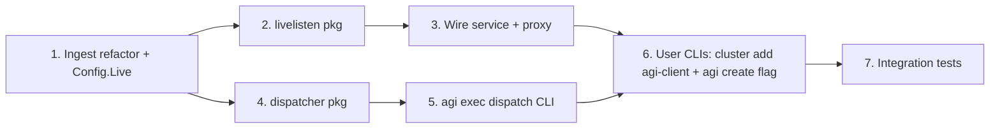

# Live AGI Log Streaming

Adds a parallel "live tail" path on top of the existing batch ingest. Both modes share one Pebble DB. The batch pipeline (Download -> Unpack -> PreProcess -> ProcessLogs) is unchanged; live ingest plugs into the same `metaShards` / `binList` / `putBatcher` and the same `logStream` parser used by `processLogFile`.

## Architecture

```mermaid
flowchart LR
    subgraph node [Aerospike node]
        AS[aerospike.service]
        LOG[/var/log/aerospike/aerospike.log<br/>or journald/]
        DISP[aerolab agi exec dispatch]
        CONF[/etc/aerospike/aerospike.conf]
        AS --> LOG
        DISP -- reads --> CONF
        DISP -- tails --> LOG
        DISP -- "asinfo -v node" --> AS
    end
    subgraph agi [AGI instance]
        PROXY[cmdAgiExecProxy<br/>:443 TLS + token]
        SVC[cmdAgiExecService]
        LIST[liveListener<br/>127.0.0.1:18080]
        BATCH["batch ingest<br/>(unchanged)"]
        BATCHER[putBatcher]
        PEBBLE[(Pebble DB)]
        PROXY -- reverse-proxy --> LIST
        LIST --> BATCHER
        BATCH --> BATCHER
        BATCHER --> PEBBLE
        SVC -.owns.- LIST
        SVC -.owns.- BATCHER
        SVC -.owns.- PEBBLE
    end
    DISP -- "POST /agi/ingest/stream<br/>chunked NDJSON" --> PROXY
```

The dispatcher does NOT get its own AGI port. It re-uses the existing `:443` HTTPS surface and the existing token-file auth at `/opt/agi/tokens`.

## Key files and packages touched

- New package: `src/pkg/agi/livelisten/` - HTTP handler, per-connection goroutine, factored out so it can be wired into the merged service without touching `ingest`'s public surface much.
- New package: `src/pkg/agi/dispatcher/` - tail-with-rotation, log-destination auto-discovery, NodeID detection, retry/backoff, offset checkpoint. Pure library; no CLI deps.
- New CLI files:
  - [src/cli/cmd/v1/cmdAgiExecDispatch.go](src/cli/cmd/v1/cmdAgiExecDispatch.go) - `aerolab agi exec dispatch` (hidden, like other exec subcommands).
  - [src/cli/cmd/v1/cmdClusterAddAgiClient.go](src/cli/cmd/v1/cmdClusterAddAgiClient.go) - `aerolab cluster add agi-client`.
- Edits to:
  - [src/pkg/agi/ingest/struct.go](src/pkg/agi/ingest/struct.go) - add `Live` config block; `LiveStreamCmd` constants for the merged service notifier event.
  - [src/pkg/agi/ingest/processlogs.go](src/pkg/agi/ingest/processlogs.go) - factor row-emit and worker pool out of `ProcessLogs` so live mode can re-use them; add exported `Ingest.RunLive(ctx)` and `Ingest.SubmitLiveLines(...)` helpers.
  - [src/cli/cmd/v1/cmdAgiExecService.go](src/cli/cmd/v1/cmdAgiExecService.go) - after batch ingest finishes, optionally start `liveListener` and park it under the same signal handler as the plugin.
  - [src/cli/cmd/v1/cmdAgiExecProxy.go](src/cli/cmd/v1/cmdAgiExecProxy.go) - register `/agi/ingest/stream` reverse-proxy route to `127.0.0.1:18080`, gated by token auth.
  - [src/cli/cmd/v1/cmdAgiCreate.go](src/cli/cmd/v1/cmdAgiCreate.go) - new `--enable-live-ingest` flag; on set, force `EnableWAL=true`, disable `PostIngestCompact`, write a service-side flag in `/opt/agi/ingest.yaml`.
  - [src/cli/cmd/v1/cmdAgi.go](src/cli/cmd/v1/cmdAgi.go) - add `Dispatch AgiExecDispatchCmd` to `AgiExecCmd`.
  - [src/cli/cmd/v1/cmdClusterAdd.go](src/cli/cmd/v1/cmdClusterAdd.go) - add `AgiClient ClusterAddAgiClientCmd`.
  - [src/cli/cmd/v1/cmdAgi_noagi.go](src/cli/cmd/v1/cmdAgi_noagi.go) - mirror the new exec subcommand stub for the noagi build tag.

## Server side: live listener (in `cmdAgiExecService`)

### `pkg/agi/livelisten`

Single exported entrypoint:

```go
func New(i *ingest.Ingest, cfg Config) *Listener
func (l *Listener) Handler() http.HandlerFunc       // for proxy reverse-proxy or direct mux
func (l *Listener) Serve(ctx context.Context) error // runs the loopback http.Server
func (l *Listener) Shutdown(ctx context.Context) error
```

The `Handler()` accepts `POST /agi/ingest/stream` with these query params and headers:

- `?cluster=bob&node=BB9A1C2&source=aerospike.log&source-id=<sha1>` - source-id is dispatcher-stable so reconnects bind to the same per-stream goroutine.
- `Authorization: Bearer <token>` - validated against same `/opt/agi/tokens` directory the proxy already watches.
- `X-Resume-Offset: 12345` - dispatcher's last-acked byte offset; ignored if no prior state for that source-id.
- Body: NDJSON or text/plain newline-delimited; one log line per record. Trailer `X-Last-Offset` written periodically by the dispatcher.

Per request the handler:

1. Looks up (or allocates) a stable nodePrefix via `i.AllocNodePrefix(cluster, node)` (new exported wrapper around the existing `progress.PreProcessor.NodeToPrefix` allocator in [src/pkg/agi/ingest/preprocess.go](src/pkg/agi/ingest/preprocess.go) - first sighting takes the lock, subsequent sightings are O(1)).
2. Builds file-scope labels exactly like `processLogsFeed` does:
   ```go
   labels := map[string]any{"ClusterName": cluster, "NodeIdent": fmt.Sprintf("%d_%s", prefix, node)}
   ```
3. Allocates a `logStream`, a per-connection `resolveCache`, and pre-resolves the file-scope labels via `i.ResolveLabelsCached(...)` (also a new exported wrapper around the unexported helper in [src/pkg/agi/ingest/processlogs.go](src/pkg/agi/ingest/processlogs.go)).
4. Reads the chunked body line-by-line through `bufio.Scanner` and calls `stream.Process(line, prefix)`. For each emitted `*logStreamOutput`, builds a `processResult` and submits it to a shared `liveResultsChan` that's drained by the same N-worker pool the batch path uses.
5. Updates an in-memory `lastOffset[source-id]` periodically; flushed to `/opt/agi/live/offsets.json` every ~1s so dispatcher resume works across AGI restarts.
6. On scanner EOF / context cancel, flushes the stream's tail emit (`stream.Close()`) and writes a final `Trailer: X-Last-Offset` value back to the dispatcher.

### Refactor of `ingest.ProcessLogs` to share the worker pool

Currently the worker pool lives inline in `ProcessLogs` ([src/pkg/agi/ingest/processlogs.go](src/pkg/agi/ingest/processlogs.go) lines ~290-353). Extract it to a method:

```go
// runWorkerPool spawns workers reading from in until in is closed,
// writing rows into i.putBatcher. Returns when the workgroup drains.
// The body is the existing `for data := range resultsChan { ... }`
// block, untouched.
func (i *Ingest) runWorkerPool(in <-chan *processResult, workers int) { ... }
```

`ProcessLogs` keeps owning `resultsChan` and the close lifecycle. Live mode opens its own `liveResultsChan` and starts its own worker pool sized by `Config.Live.Workers` (default 16).

`processResult`, `mergeResolved`, `resolveLabelsCached`, `upsertMetaEntry`, `binList.missingNames`, and `putBatcher.submit` all stay private to the package; the listener calls them via thin exported wrappers (`SubmitLiveLine`, `AllocLiveStream`, `ResolveLiveLabels`) so we don't have to widen the public surface significantly.

### Lifecycle changes in [cmdAgiExecService.go](src/cli/cmd/v1/cmdAgiExecService.go)

After the existing `ingestWG.Add(1)` block (lines ~253-269) and before `p.Listen()`, add:

```go
var liveSrv *livelisten.Listener
if ingestCfg.Live.Enabled && !c.SkipIngest {
    liveSrv = livelisten.New(inner.ingest, livelisten.Config{
        ListenAddr:  ingestCfg.Live.ListenAddr,        // default 127.0.0.1:18080
        OffsetsPath: "/opt/agi/live/offsets.json",
        TokensPath:  "/opt/agi/tokens",
    })
    go func() {
        if err := liveSrv.Serve(ctx); err != nil && !errors.Is(err, http.ErrServerClosed) {
            system.Logger.Warn("live listener: %s", err)
        }
    }()
    // Augment SIGTERM handler to also shut down liveSrv before plugin.
}
```

Two semantic adjustments needed:

- `Ingest.Close()` currently drains `putBatcher` and stops the goroutines. In live mode we need the batcher to stay alive after `LogProcessor.Finished=true`. Solution: live mode keeps a refcount on `putBatcher` so `Close()` only fires when both batch + live are done.
- The `dirty marker` mechanism in [src/pkg/agi/ingest/init.go](src/pkg/agi/ingest/init.go) (lines 314-320) wipes the DB on next start if WAL is off. With live ingest the DB has rows that have NO source file to re-ingest from; live mode therefore requires `EnableWAL=true`. We enforce this in `cmdAgiCreate` (set in plugin.yaml when `--enable-live-ingest` is true) and refuse to start the live listener at runtime if `dbOpts.EnableWAL` is false (with an explicit log message).

### Proxy reverse-proxy edit in [cmdAgiExecProxy.go](src/cli/cmd/v1/cmdAgiExecProxy.go)

Register one new handler next to the existing `/agi/*` routes around line 357:

```go
http.HandleFunc("/agi/ingest/stream", c.tokenGate(c.handleIngestStream))
```

`handleIngestStream` is a thin `httputil.ReverseProxy` to `http://127.0.0.1:18080/agi/ingest/stream` that streams the chunked body verbatim (`FlushInterval: -1` so chunks are forwarded immediately, no buffering). `c.tokenGate` wraps the existing `c.isTokenAuth` validation already used elsewhere in the proxy.

### `Config.Live` block in [src/pkg/agi/ingest/struct.go](src/pkg/agi/ingest/struct.go)

```go
Live struct {
    Enabled    bool   `yaml:"enabled" default:"false" envconfig:"LOGINGEST_LIVE_ENABLED"`
    ListenAddr string `yaml:"listenAddr" default:"127.0.0.1:18080" envconfig:"LOGINGEST_LIVE_ADDR"`
    Workers    int    `yaml:"workers" default:"16"`
    MaxStreams int    `yaml:"maxStreams" default:"256"` // safety cap
} `yaml:"live"`
```

## Dispatcher side: `pkg/agi/dispatcher` + `aerolab agi exec dispatch`

### Auto-discovery using `pkg/conf/aerospike`

The dispatcher reads `/etc/aerospike/aerospike.conf` via `github.com/rglonek/aerospike-config-file-parser` (already a dependency, see [src/pkg/conf/aerospike/confeditor7/editor.go](src/pkg/conf/aerospike/confeditor7/editor.go) line 12). Walk the `logging` stanza:

```go
keys := cfg.Stanza("logging").ListKeys()  // values like "file /var/log/aerospike/aerospike.log", "console"
for _, k := range keys {
    switch {
    case strings.HasPrefix(k, "file "):
        // file path = strings.TrimPrefix(k, "file ")
        return SourceFile{Path: k[5:]}, nil
    case strings.HasPrefix(k, "console"):
        return SourceJournal{Unit: "aerospike.service"}, nil
    }
}
```

This matches the same pattern used in [src/pkg/conf/aerospike/confeditor7/editor.go](src/pkg/conf/aerospike/confeditor7/editor.go) lines 789-802. Manual `--source-file` / `--source-journal` flags override discovery.

### NodeID/cluster discovery (layered fallback)

1. `asinfo -v node` and `asinfo -v cluster-name` over `127.0.0.1:3000` - instant, deterministic. Use a small Go asinfo client (or shell out).
2. If asinfo unavailable, tail-and-wait for the first `NODE-ID ... CLUSTER-NAME ...` ticker line using the same regex shipped in [src/pkg/agi/ingest/struct.go](src/pkg/agi/ingest/struct.go) line 428. Buffer up to ~30s of log locally; on hit, re-tail from start.
3. CLI overrides: `--node-id`, `--cluster-name`.

### Tail with rotation

For file source: stat (path, inode, size); on rotation (inode change) drain old fd to EOF, reopen new file, reset offset. Roll our own (~80 LOC) rather than pull in a tail dep, since we already have `bufio.Scanner`.

For journal source: shell out to `journalctl -fn0 -u aerospike --output=cat` and read its stdout. (`go-systemd/sdjournal` would be cleaner but requires CGo and is not currently in vendor; the `journalctl` exec path keeps the binary statically linked.)

### Outbound POST loop

One goroutine per source. Builds the chunked POST body as the tail produces lines. Reconnect with exponential backoff 1s..30s on any error. Resume from `state.Offset` (file source) or from `--cursor` (journal source) when reconnecting.

### CLI

```go
type AgiExecDispatchCmd struct {
    Target         string `long:"target" description:"AGI URL, e.g. https://10.0.0.5:443" required:"true"`
    TokenFile      string `long:"token-file" description:"Path to bearer token" default:"/etc/aerolab/agi-dispatch.token"`
    ClusterName    string `long:"cluster" description:"Cluster name (default: auto-detect via asinfo)"`
    NodeID         string `long:"node-id" description:"Node ID (default: auto-detect via asinfo)"`
    SourceFile     string `long:"source-file" description:"Path to log file (default: auto-detect from aerospike.conf)"`
    SourceJournal  string `long:"source-journal" description:"Systemd unit to follow via journalctl (default: aerospike.service if console logging detected)"`
    AerospikeConf  string `long:"aerospike-conf" default:"/etc/aerospike/aerospike.conf"`
    StateFile      string `long:"state-file" default:"/var/lib/aerolab/agi-dispatch.state"`
    InsecureTLS    bool   `long:"insecure-tls" description:"Skip server cert verification (default: trust /opt/aerolab/agi-ca.pem if present)"`
    BackfillFromStart bool `long:"backfill-from-start"`
    Help HelpCmd `command:"help" subcommands-optional:"true" description:"Print help"`
}
```

Wired into `AgiExecCmd` in [cmdAgi.go](src/cli/cmd/v1/cmdAgi.go) as `Dispatch AgiExecDispatchCmd `command:"dispatch" hidden:"true"`` (matching the pattern of other exec subcommands).

## User-facing wiring

### `aerolab agi create --enable-live-ingest`

In [cmdAgiCreate.go](src/cli/cmd/v1/cmdAgiCreate.go) add:

```go
EnableLiveIngest bool `long:"enable-live-ingest" description:"Open the live log streaming endpoint; requires WAL=on"`
```

When true:
- Write `live: { enabled: true, listenAddr: 127.0.0.1:18080 }` into `/opt/agi/ingest.yaml` during cluster bootstrap.
- Force `EnableWAL: true`, `PostIngestCompact: false` in `/opt/agi/plugin.yaml`.
- Generate a token and write it to `/opt/agi/tokens/dispatcher` (joined with the existing token-watch loop in [cmdAgiExecProxy.go](src/cli/cmd/v1/cmdAgiExecProxy.go) line 469).
- Print the token + URL on success so user can plumb it through.

### `aerolab cluster add agi-client`

New file [cmdClusterAddAgiClient.go](src/cli/cmd/v1/cmdClusterAddAgiClient.go), modeled on [cmdClusterAddExporter.go](src/cli/cmd/v1/cmdClusterAddExporter.go):

```go
type ClusterAddAgiClientCmd struct {
    ClusterName    TypeClusterName `short:"n" long:"name" required:"true"`
    Nodes          TypeNodes       `short:"l" long:"nodes" default:""`
    SendLogsTo     string          `long:"send-logs-to" description:"AGI instance name to dispatch logs to" required:"true"`
    AerolabBinary  flags.Filename  `long:"aerolab-binary"`
    InsecureTLS    bool            `long:"insecure-tls"`
    ParallelThreads int            `short:"p" long:"parallel-threads" default:"10"`
    Help HelpCmd ...
}
```

Execute:
1. Look up the AGI by `--send-logs-to` in inventory; resolve its IP and the dispatcher token (read from the AGI's `/opt/agi/tokens/dispatcher` via SSH or, if AGI is in same inventory, from local cache written by `agi create`).
2. For each cluster node in parallel (re-use `parallelize.ForEachLimit`):
   - Push aerolab binary (re-use `cluster add aerolab` helpers).
   - Write `/etc/aerolab/agi-dispatch.token`.
   - Render and write a systemd unit to `/etc/systemd/system/aerolab-agi-dispatch.service`:
     ```ini
     [Unit]
     After=aerospike.service
     Wants=aerospike.service
     [Service]
     ExecStart=/usr/local/bin/aerolab agi exec dispatch \
         --target https://<agi-ip>:443 \
         --token-file /etc/aerolab/agi-dispatch.token \
         --state-file /var/lib/aerolab/agi-dispatch.state
     Restart=always
     RestartSec=2s
     [Install]
     WantedBy=multi-user.target
     ```
   - `systemctl daemon-reload && systemctl enable --now aerolab-agi-dispatch.service`.
3. Re-running with a different `--send-logs-to` re-renders + restarts; idempotent.

Registered in [cmdClusterAdd.go](src/cli/cmd/v1/cmdClusterAdd.go) as `AgiClient ClusterAddAgiClientCmd`.

## Edge cases and invariants

- Live mode requires `EnableWAL=true`. The service refuses to start the listener (with a clear log line) if WAL is off, even if `Live.Enabled=true`. Documented in `Config.Live.Enabled` doc comment.
- Live mode keeps the existing batch path 100% intact. The merged service's existing flow runs unchanged: on first start a fresh AGI with no source files completes batch ingest in milliseconds (zero files), `LogProcessor.Finished=true`, and only then live ingest takes over. The notifier event sequence is unchanged.
- Node-prefix allocation is re-used for live streams via `progress.PreProcessor.NodeToPrefix`. Since both paths funnel through the same allocator, mixing batch + live (e.g., ingest historical logs first, then attach live) produces consistent prefixes for the same `(cluster,node)` pair.
- Per-stream caps: the listener rejects new connections when `len(activeStreams) >= Config.Live.MaxStreams` with HTTP 429.
- Token rotation: tokens live in `/opt/agi/tokens/`; the proxy already watches the directory with fsnotify (see [cmdAgiExecProxy.go](src/cli/cmd/v1/cmdAgiExecProxy.go) line 538). Operator can rotate by writing a new file; old dispatcher connections are not killed (no need - they just keep working until they reconnect, at which point the old token file would be gone).
- The "sources" label in [src/pkg/agi/ingest/init.go](src/pkg/agi/ingest/init.go) lines 274-289 currently shows S3/SFTP/local-file. Add a `live` source string when `Live.Enabled=true` so Grafana's source label panel reflects live activity. Updated periodically by the listener as streams come and go.
- Compaction: live mode disables `PostIngestCompact` (would block live stream during compaction). Recommend an op-doc note about a daily cron `aerolab agi attach -- pebble compact` (or equivalent helper) for long-running live AGIs.

## Testing strategy

- Unit tests in `pkg/agi/livelisten`: golden-input test that POSTs a known log fixture (re-use a fixture from [src/pkg/agi/ingest/ingest_test.go](src/pkg/agi/ingest/ingest_test.go)) and asserts the same rows land in the DB as the batch path produces from the same fixture.
- Unit tests in `pkg/agi/dispatcher`: log-destination auto-discovery with sample aerospike.conf snippets (file-only, console-only, both); rotation test (touch new file with same name); reconnect-after-write-error test.
- Integration test in [src/cli/cmd/v1/cmdAgiCreate_pebble_test.go](src/cli/cmd/v1/cmdAgiCreate_pebble_test.go) style: spin up an in-process `cmdAgiExecService` with `Live.Enabled=true`, POST to `127.0.0.1:18080`, assert rows queryable via the plugin.
- Manual smoke: `aerolab cluster create -n bob && aerolab agi create -n bobagi --enable-live-ingest && aerolab cluster add agi-client -n bob --send-logs-to bobagi` then run a workload and watch Grafana update live.

## Subagent execution plan (sequential)

The work is split into seven sequential subagents. Each phase compiles cleanly on its own (no half-broken builds between phases), produces a tight, named set of exported symbols / route paths / CLI flags that the next phase consumes, and has a bounded file set so each agent's context stays small.



### Phase 1 - `pkg/agi/ingest` refactor and Config.Live

Scope:
- Extract the worker pool body from `Ingest.ProcessLogs` (currently inline at [src/pkg/agi/ingest/processlogs.go](src/pkg/agi/ingest/processlogs.go) lines ~290-353) into a new method `(i *Ingest) runWorkerPool(in <-chan *processResult, workers int)`.
- Add three thin exported wrappers around existing internal helpers, with no behavior change:
  - `Ingest.AllocLiveStream(cluster, nodeID string) (prefix int)` - wraps the `LastUsedPrefix++` allocator from [src/pkg/agi/ingest/preprocess.go](src/pkg/agi/ingest/preprocess.go) lines 226-236, callable independently of `PreProcess`.
  - `Ingest.ResolveLiveLabels(labels map[string]any, cache ResolveCache, cluster, source string) ResolvedLabels` - wraps `resolveLabelsCached`.
  - `Ingest.SubmitLiveResult(r *ProcessResult)` - pushes a row onto the live-mode `resultsChan`, OR exposes the channel directly via `Ingest.LiveResultsChan() chan<- *ProcessResult` plus a `StartLiveWorkers(ctx, n int) error` to spawn the worker pool. Pick whichever yields the simpler test surface.
  - Re-export `processResult` as `ProcessResult` (or keep it private and expose a `NewProcessResult(...)` constructor so callers can't accidentally bypass the row contract).
- Add `Config.Live` block to [src/pkg/agi/ingest/struct.go](src/pkg/agi/ingest/struct.go) as documented above.
- Add `Ingest.PutBatcherRetain()` / `PutBatcherRelease()` refcount so `Close()` only fires when both batch and live release. Initially batch holds 1 ref; live mode adds 1 on Serve and releases on Shutdown.

Files touched (all under `src/pkg/agi/ingest/`): `processlogs.go`, `preprocess.go`, `struct.go`, `init.go`, `run.go` (likely).

Exit criteria:
- `go build ./...` passes.
- Existing tests in `src/pkg/agi/ingest/ingest_test.go` and `src/pkg/agi/db/fixes_test.go` pass unchanged (this is a pure refactor; behavior of batch ingest must be byte-identical).
- New, exported symbols documented in a short package doc comment listing the live-mode contract.

Handoff to phase 2: documented exported function signatures (paste them into the chat for phase 2).

### Phase 2 - `pkg/agi/livelisten` package

Scope:
- Create `src/pkg/agi/livelisten/{listener.go,handler.go,offsets.go,doc.go}`.
- Public API exactly:
  ```go
  type Config struct {
      ListenAddr  string
      OffsetsPath string
      TokensPath  string
      MaxStreams  int
      Workers     int
  }
  type Listener struct { /* unexported */ }
  func New(i *ingest.Ingest, cfg Config) *Listener
  func (l *Listener) Serve(ctx context.Context) error
  func (l *Listener) Shutdown(ctx context.Context) error
  func (l *Listener) Handler() http.HandlerFunc
  ```
- Per-request flow as described in the architecture section above; uses ONLY the exported wrappers from phase 1.
- Sources label update in [src/pkg/agi/ingest/init.go](src/pkg/agi/ingest/init.go) is folded into this phase since it's the simplest place to expose "live N streams active" without circular imports - or moved into phase 3 if it requires touching the listener wiring. (Suggest leaving it as a callback `cfg.OnStreamCountChange func(int)` so the listener doesn't import ingest's label internals.)

Files created: 4 files under `src/pkg/agi/livelisten/`. Files edited: none in `pkg/agi/ingest` (phase 1 already exposed everything needed).

Exit criteria:
- `go build ./pkg/agi/livelisten/...` passes.
- Unit test `livelisten_test.go`: spin up listener pointed at an in-memory `ingest.Ingest` (constructed via existing test helpers), POST a multi-line fixture, assert rows land via `i.db.Get`. Re-use a known fixture from `ingest_test.go`.
- Handler returns proper status codes: 401 missing/bad token, 429 too many streams, 200 on clean close.

Handoff to phase 3: route path (`POST /agi/ingest/stream`), default loopback addr (`127.0.0.1:18080`), and the Listener constructor signature.

### Phase 3 - Wire service + proxy

Scope:
- Edit [src/cli/cmd/v1/cmdAgiExecService.go](src/cli/cmd/v1/cmdAgiExecService.go):
  - After the existing `ingestWG` goroutine block (lines ~253-269) and before `p.Listen()`, optionally construct a `livelisten.Listener` and start it.
  - Refuse to start (warn-and-return-nil from the listener goroutine) when `dbOpts.EnableWAL=false`.
  - Hook `liveSrv.Shutdown(ctx)` into the SIGTERM handler before `p.Shutdown()`.
- Edit [src/cli/cmd/v1/cmdAgiExecProxy.go](src/cli/cmd/v1/cmdAgiExecProxy.go):
  - Register `/agi/ingest/stream` next to existing routes (line ~357).
  - Implement `c.handleIngestStream` as `httputil.ReverseProxy` to `http://127.0.0.1:18080` with `FlushInterval=-1` and the existing `c.isTokenAuth` gate.
- Adjust `Ingest.Close()` callsites for the refcount change (no-op if phase 1 picked the constructor approach).

Files touched: 2 CLI files only.

Exit criteria:
- `go build ./cli/...` passes (including `noagi` build tag).
- Manual smoke: start the merged service locally with `--ingest-yaml /tmp/ingest.yaml` containing `live: { enabled: true }`, hit `POST /agi/ingest/stream` via `curl -k --data-binary @somelog https://localhost/agi/ingest/stream`, observe rows via `aerolab agi query`.

Handoff to phase 4: nothing needed - phase 4 is independent.

### Phase 4 - `pkg/agi/dispatcher` package

Scope:
- Create `src/pkg/agi/dispatcher/{dispatcher.go,discover.go,tail.go,journal.go,asinfo.go,state.go,doc.go}`.
- Public API:
  ```go
  type Config struct {
      Target         string
      Token          string
      ClusterName    string  // optional, auto-detected if empty
      NodeID         string  // optional
      AerospikeConf  string  // path to aerospike.conf for auto-discovery
      SourceFile     string  // override
      SourceJournal  string  // override
      StateFile      string
      InsecureTLS    bool
      BackfillFromStart bool
  }
  type Dispatcher struct { /* unexported */ }
  func New(cfg Config) *Dispatcher
  func (d *Dispatcher) Run(ctx context.Context) error
  ```
- `discover.go` uses `github.com/rglonek/aerospike-config-file-parser` (already vendored, see [src/pkg/conf/aerospike/confeditor7/editor.go](src/pkg/conf/aerospike/confeditor7/editor.go) line 12) to walk the `logging` stanza; `asinfo.go` is a tiny TCP client for `127.0.0.1:3000` doing the asinfo handshake (or shells out to `asinfo` if simpler).
- `tail.go` is a self-contained inode+rotation follower (~80 LOC, no external deps).
- `journal.go` shells out to `journalctl -fn0 -u <unit> --output=cat`.

Files created: ~7 files under `src/pkg/agi/dispatcher/`. No edits elsewhere.

Exit criteria:
- `go build ./pkg/agi/dispatcher/...` passes.
- Unit tests: discovery against three sample conf files (file-only, console-only, both); rotation test (write file, rename, write new file - assert all bytes captured); asinfo client test against a fake TCP server.

Handoff to phase 5: just the public API signature.

### Phase 5 - `aerolab agi exec dispatch` CLI

Scope:
- Create [src/cli/cmd/v1/cmdAgiExecDispatch.go](src/cli/cmd/v1/cmdAgiExecDispatch.go) with the `AgiExecDispatchCmd` struct shown in the architecture section.
- Register in [src/cli/cmd/v1/cmdAgi.go](src/cli/cmd/v1/cmdAgi.go) under `AgiExecCmd` with `command:"dispatch" hidden:"true"`.
- Mirror in [src/cli/cmd/v1/cmdAgi_noagi.go](src/cli/cmd/v1/cmdAgi_noagi.go) as a stub returning `errNoAGI` (matching the pattern of every other exec subcommand there).
- Wires CLI flags into a `dispatcher.Config{}`, reads token from `--token-file`, calls `dispatcher.New(cfg).Run(ctx)`.

Files touched: 3 CLI files.

Exit criteria:
- `go build ./...` passes (both with and without the `noagi` build tag).
- `aerolab agi exec dispatch --help` renders correctly.
- Manual smoke against the phase-3 server: spin up an aerospike node locally, run `aerolab agi exec dispatch --target https://localhost:443 --token-file /tmp/tok`, observe rows in the AGI.

### Phase 6 - User-facing CLIs

Scope:
- Create [src/cli/cmd/v1/cmdClusterAddAgiClient.go](src/cli/cmd/v1/cmdClusterAddAgiClient.go) modeled on [src/cli/cmd/v1/cmdClusterAddExporter.go](src/cli/cmd/v1/cmdClusterAddExporter.go); register in [src/cli/cmd/v1/cmdClusterAdd.go](src/cli/cmd/v1/cmdClusterAdd.go) as `AgiClient ClusterAddAgiClientCmd`.
- Add `--enable-live-ingest` to [src/cli/cmd/v1/cmdAgiCreate.go](src/cli/cmd/v1/cmdAgiCreate.go) and route it into `ingest.yaml` (set `Live.Enabled=true`) and `plugin.yaml` (force `EnableWAL=true`, `PostIngestCompact=false`); generate a token under `/opt/agi/tokens/dispatcher` during instance bootstrap.
- Implement idempotency in `cluster add agi-client`: re-running with a different `--send-logs-to` re-renders the systemd unit and `systemctl restart`s it.

Files touched: 3 CLI files (one new, two edited).

Exit criteria:
- `go build ./...` passes.
- `aerolab agi create --help` and `aerolab cluster add agi-client --help` render correctly with the new flags.
- Idempotency check: run `cluster add agi-client` twice with the same args, assert no errors and the unit is unchanged.

### Phase 7 - Integration tests + smoke playbook

Scope:
- Add `cmdAgiCreate_live_test.go` next to [src/cli/cmd/v1/cmdAgiCreate_pebble_test.go](src/cli/cmd/v1/cmdAgiCreate_pebble_test.go): in-process service with `Live.Enabled=true`, `EnableWAL=true`, POST log fixture, assert rows queryable via plugin.
- Add a multi-line stream-resume test: POST first half, drop the connection, POST second half with `X-Resume-Offset`, assert no duplicates and no gaps.
- Add a short README section under [src/pkg/agi/README.md](src/pkg/agi/README.md) describing the live-ingest data path and the operator playbook (`aerolab agi create --enable-live-ingest`, `aerolab cluster add agi-client --send-logs-to`).

Files touched: 1 new test file, 1 README edit.

Exit criteria:
- `go test ./cli/cmd/v1/... -run Live` passes.
- The end-to-end smoke playbook in the README is verified manually once.

### Context budget per phase

Approximate file-touch counts per phase, to confirm each agent's context stays bounded:

- Phase 1: ~5 files in one package (~3500 LOC peak read for `processlogs.go`, but pure refactor scope).
- Phase 2: 4 new files + read 2-3 files from `pkg/agi/ingest` for type imports.
- Phase 3: 2 CLI files.
- Phase 4: 7 new files + 1 reference read (`confeditor7/editor.go` for the parser usage example).
- Phase 5: 3 CLI files.
- Phase 6: 3 CLI files.
- Phase 7: 1-2 files.

No phase exceeds ~5 substantive source files. The single largest read is `processlogs.go` (1161 lines) in phase 1, which is unavoidable.
