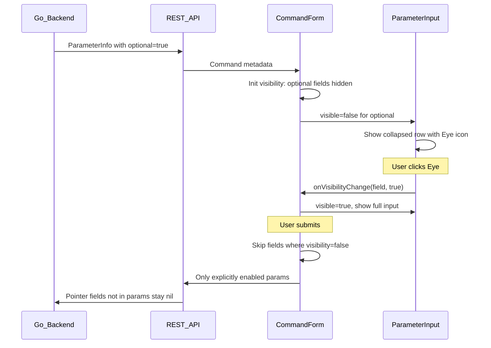

# AGI reRun Ingest - Optional Field Eye Toggle

## Problem

The AGI `run-ingest` command (`AgiRetriggerCmd`) uses Go pointer types (`*string`, `*bool`, `*int`, `*flags.Filename`) for ~25 optional parameters. In the backend, nil pointers mean "don't change this setting." The old v780 web UI had an eye-icon toggle that hid optional fields by default and only submitted them when the user explicitly revealed them. The new React web UI has this feature **commented out** and the backend doesn't communicate which fields are optional (pointer-typed).

## Current State

- **Backend**: `extractParameter()` in `cmdWebUIReflect.go` strips pointer wrappers via `getTypeName()` but does not mark the resulting `ParameterInfo` as optional. `applyParameters()` already correctly leaves pointer fields nil when not present in submitted params.
- **Frontend**: Eye toggle code is commented out in `ParameterInput.tsx` and `SelectInput.tsx`. Visibility state (`visibility`) and submission filtering (`if (visibility[k] === false) continue`) exist in `CommandForm.tsx` but nothing ever sets visibility to `false`.
- **ToggleInput**: Already shows ON/UNSET/OFF for optional booleans (detected via `param.noDefault || param.default === ''`), which happens to work for `*bool` fields since they have no default tag.

## Changes Required

### 1. Backend: Expose `optional` flag in ParameterInfo

**File**: `[src/cli/cmd/v1/cmdWebUIReflect.go](src/cli/cmd/v1/cmdWebUIReflect.go)`

- Add `Optional bool` field to `ParameterInfo` struct (around line 120):
  ```go
  Optional      bool     `json:"optional,omitempty"`
  ```
- In `extractParameter()` (around line 327), after determining the type, detect pointer types and set `Optional`:
  ```go
  if field.Type.Kind() == reflect.Ptr {
      param.Optional = true
      param.NoDefault = true  // ensures ToggleInput uses ON/UNSET/OFF for *bool
  }
  ```
- In `extractGroupParameters()` - apply the same pointer detection for group fields if any use pointer types.

### 2. Frontend: Add `optional` to TypeScript types

**File**: `[web/webui/src/api/types.ts](web/webui/src/api/types.ts)`

- Add `optional?: boolean` to the `ParameterInfo` interface.

### 3. Frontend: Initialize optional field visibility

**File**: `[web/webui/src/components/command/CommandForm.tsx](web/webui/src/components/command/CommandForm.tsx)`

- In the `useEffect` that runs on `commandInfo.path` change, initialize `visibility` so that optional fields start as `false` (hidden):
  ```typescript
  const initVisibility: Record<string, boolean> = {}
  for (const p of params) {
    if (p.optional && getInputType(p) !== 'toggle') {
      initVisibility[p.fieldName] = false
    }
  }
  ```
  (Toggle inputs use ON/UNSET/OFF instead of the eye pattern, so they stay visible.)
- In `applyUrlParams`, track which optional fields got values from URL params and set their visibility to `true`:
  ```typescript
  // After setting an optional field from URL params:
  if (p.optional) urlSetFields.add(p.fieldName)
  ```
  Then merge these into `setVisibility`.
- Update `handleSubmit` to allow explicitly-revealed optional fields to submit even with empty values. The existing empty-value skip (`if (v === '' && !required) continue`) must be bypassed when the user has explicitly toggled an optional field visible, so that setting a field to empty string (e.g., clearing a regex filter) works:
  ```typescript
  // In the submission loop:
  if (visibility[k] === false) continue                       // hidden optional → skip
  const param = params.find((p) => p.fieldName === k)
  const explicitlyRevealed = param?.optional && visibility[k] === true
  if (v === '' && !param?.required && !explicitlyRevealed) continue  // empty non-revealed → skip
  ```
  This mirrors the old v780 behavior where `isSet=yes` caused the value to be submitted regardless of whether it was empty.

### 4. Frontend: Uncomment eye toggle in ParameterInput

**File**: `[web/webui/src/components/command/ParameterInput.tsx](web/webui/src/components/command/ParameterInput.tsx)`

- Uncomment `import { Eye, EyeOff } from 'lucide-react'`
- Rename `_visible` back to `visible` and `_onVisibilityChange` back to `onVisibilityChange`
- Uncomment the early-return block that shows the collapsed view with Eye button when `!visible`
- Guard the collapsed view so it only applies when `param.optional` is true (non-optional fields always render normally):
  ```typescript
  if (param.optional && !visible) {
    return ( /* collapsed eye-button row */ )
  }
  ```
- Add an EyeOff button next to the label when the field is visible and optional, so users can hide it again.

### 5. Frontend: Uncomment eye toggle in SelectInput

**File**: `[web/webui/src/components/command/SelectInput.tsx](web/webui/src/components/command/SelectInput.tsx)`

- Same pattern as ParameterInput: uncomment Eye import, restore `visible`/`onVisibilityChange`, guard with `param.optional`.

### 6. Frontend: Add visibility support to FileInput

**File**: `[web/webui/src/components/command/FileInput.tsx](web/webui/src/components/command/FileInput.tsx)`

- Add `visible` and `onVisibilityChange` props.
- Add the same eye toggle pattern for optional file inputs.
- Update `CommandForm.tsx` and `ParameterGroup.tsx` to pass visibility props to `FileInput`.

### 7. Frontend: ToggleInput (minimal changes)

**File**: `[web/webui/src/components/command/ToggleInput.tsx](web/webui/src/components/command/ToggleInput.tsx)`

- Update `isOptionalBoolean` to also check `param.optional`:
  ```typescript
  function isOptionalBoolean(param: ParameterInfo): boolean {
    return !!param.optional || !!param.noDefault || param.default === '' || param.default === undefined
  }
  ```
- No eye toggle needed here since ON/UNSET/OFF already handles the "don't send" case (UNSET = empty string, which is filtered out on submit).

### 8. Frontend: ParameterGroup (propagation)

**File**: `[web/webui/src/components/command/ParameterGroup.tsx](web/webui/src/components/command/ParameterGroup.tsx)`

- Already passes `visible`/`onVisibilityChange` to ParameterInput and SelectInput.
- Add the same props to FileInput rendering.

## Data Flow




## Files Changed Summary

- `src/cli/cmd/v1/cmdWebUIReflect.go` - Add `Optional` to ParameterInfo, detect pointer types
- `web/webui/src/api/types.ts` - Add `optional` field
- `web/webui/src/components/command/CommandForm.tsx` - Init optional visibility, URL param handling
- `web/webui/src/components/command/ParameterInput.tsx` - Restore eye toggle
- `web/webui/src/components/command/SelectInput.tsx` - Restore eye toggle
- `web/webui/src/components/command/FileInput.tsx` - Add eye toggle support
- `web/webui/src/components/command/ToggleInput.tsx` - Check `param.optional`
- `web/webui/src/components/command/ParameterGroup.tsx` - Pass visibility to FileInput

