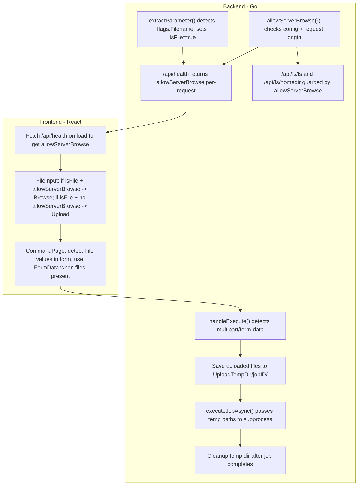

# File Browser and Upload Support for Web UI

## Context

The old web UI (v7.8.0) dynamically chose between server-side file browsing and client-side file upload based on:

- Whether the request came from localhost (no proxy headers)
- Config flags: `BlockServerLs`, `AllowLsEverywhere`, `MaxUploadSizeBytes`

The new web UI has the file browser and upload plumbing in place but lacks:

1. Auto-detection of `flags.Filename` fields (currently only `webtype:"upload"` and `webtype:"file"` trigger file UI)
2. Dynamic switching between browse vs upload based on connection locality
3. Handling of file uploads for commands that expect local paths (not just `files/upload`)

## Architecture




## Backend Changes

### 1. Add config options to `WebUICmd` ([cmdWebUI.go](src/cli/cmd/v1/cmdWebUI.go))

Add these fields to the `WebUICmd` struct:

```go
BlockServerLs      bool           `long:"block-server-ls" description:"Block file exploration on the server altogether"`
AllowLsEverywhere  bool           `long:"always-server-ls" description:"By default server file browser only works on localhost; enable to allow from everywhere"`
MaxUploadSizeBytes int            `long:"max-upload-size-bytes" description:"Max file upload size in bytes when server browsing is blocked (0=disable uploads)" default:"209715200"`
UploadTempDir      string         `long:"upload-temp-dir" description:"Temporary directory for file uploads (default: {aerolabRoot}/web.tmp)"`
```

### 2. Add `allowServerBrowse(r)` method ([cmdWebUI.go](src/cli/cmd/v1/cmdWebUI.go))

Port the old `allowls` logic:

- If `BlockServerLs` -> false
- If `AllowLsEverywhere` -> true
- Otherwise: check if request is from localhost (127.0.0.1 / ::1) with no `X-Real-IP`, `X-Forwarded-For`, or `X-Forwarded-Host` headers

### 3. Guard file browser endpoints ([cmdWebUIFileBrowser.go](src/cli/cmd/v1/cmdWebUIFileBrowser.go))

Add `allowServerBrowse(r)` check at the top of `handleFSHomedir` and `handleFSLs`. Return 403 if not allowed.

### 4. Expose `allowServerBrowse` in health response ([cmdWebUI.go](src/cli/cmd/v1/cmdWebUI.go))

Update `handleHealth` to accept `r *http.Request` context and include `allowServerBrowse` in the JSON response. This lets the frontend know per-request whether to show browse or upload.

### 5. Detect `flags.Filename` in reflection ([cmdWebUIReflect.go](src/cli/cmd/v1/cmdWebUIReflect.go))

- Add `IsFile bool` field to `ParameterInfo` struct (JSON tag: `"isFile,omitempty"`)
- In `extractParameter()`, after determining the type, check if `field.Type.String() == "flags.Filename"` and set `IsFile: true`
- In `extractPositionalParameters()`, same detection for positional args
- In `getTypeName()`, handle `flags.Filename` -> "string" (already works implicitly, but good to be explicit)

### 6. Handle multipart uploads in command execution ([cmdWebUI.go](src/cli/cmd/v1/cmdWebUI.go))

In `handleExecute()`, before calling `executeCommand()`:

- Check `Content-Type` for `multipart/form-data`
- If multipart: parse form, extract file fields and text fields
- For each file field: save to `{UploadTempDir}/{jobID}/{fieldName}`, record temp path
- Build params map: file fields get temp path strings, other fields as normal
- Pass `tempDir` to the Job so `executeJobAsync` can clean it up

### 7. Cleanup temp files after job ([cmdWebUI.go](src/cli/cmd/v1/cmdWebUI.go))

- Add `TempDir string` field to `Job` struct in [cmdWebUIJobs.go](src/cli/cmd/v1/cmdWebUIJobs.go)
- In `executeJobAsync()`, after the subprocess completes and status is updated, `defer os.RemoveAll(job.TempDir)` if non-empty

## Frontend Changes

### 8. Update TypeScript types ([types.ts](web/webui/src/api/types.ts))

- Add `isFile?: boolean` to `ParameterInfo` interface
- Add `allowServerBrowse?: boolean` to `HealthResponse` interface

### 9. Update `FileInput.tsx` ([FileInput.tsx](web/webui/src/components/command/FileInput.tsx))

Accept an `allowServerBrowse` prop. Decision logic:


| `webType`    | `isFile` | `allowServerBrowse` | UI                                              |
| ------------ | -------- | ------------------- | ----------------------------------------------- |
| `"upload"`   | any      | any                 | Native file upload (always)                     |
| `"download"` | any      | any                 | Read-only text (always)                         |
| `"text"`     | any      | any                 | Plain text input (always)                       |
| none         | true     | true                | Text input + Browse button                      |
| none         | true     | false               | Native file upload                              |
| none         | false    | any                 | Regular text input (should not reach FileInput) |


### 10. Update form rendering

- [ParameterGroup.tsx](web/webui/src/components/command/ParameterGroup.tsx): Update `getInputComponent` to return `'file'` when `param.isFile` is true (even without explicit webType)
- [CommandForm.tsx](web/webui/src/components/command/CommandForm.tsx): Same update to `getInputType`. Pass `allowServerBrowse` from health response to `FileInput`.
- Need a way to get `allowServerBrowse` into the form components. Options: React context, prop drilling from CommandPage, or a custom hook. React context is cleanest.

### 11. Update form submission ([CommandPage.tsx](web/webui/src/pages/CommandPage.tsx), [client.ts](web/webui/src/api/client.ts))

- Add a new `executeCommandWithFiles()` function in `client.ts` that:
  - Creates `FormData` with a `_params` JSON blob for non-file fields
  - Appends each `File` value with its field name as the form key
  - POSTs to the command path with multipart/form-data
- In `CommandPage.tsx`, detect if any form value is a `File` instance. If so, call `executeCommandWithFiles()` instead of `executeCommand()`.

### 12. Propagate `allowServerBrowse` from health

- The existing `fetchHealth()` is already called on app load. Store `allowServerBrowse` in a React context or Zustand store.
- Pass it down to `CommandForm` / `FileInput` via props or context.

## Key Decisions

- **Per-request vs per-session**: `allowServerBrowse` is evaluated per-request in the health endpoint (like old code) but cached per-session on the frontend. This is sufficient since a session's network origin doesn't change.
- **File upload for regular commands**: Files are saved to a server temp directory and the temp path is passed to the subprocess. This matches the old code's approach.
- **Explicit `webtype` overrides auto-detection**: If a field has `webtype:"text"`, it stays as plain text even if it's `flags.Filename`. Same for `webtype:"upload"` and `webtype:"download"`.

