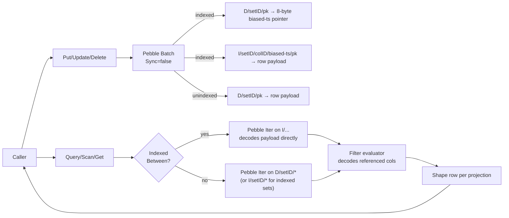

# `agi/db` — embedded fast DB for AGI

This package is a single-node, embedded, throwaway-fast database tailored to
the AGI ingest + plugin workload. It is the storage backend used by
`pkg/agi/ingest` and `pkg/agi/plugin`.

## Design goals

- **Sparse-column rows per "set"**: each set is a logical table; each row is
  a sparse `map[string]Value` of typed columns. Columns are registered
  either explicitly via `RegisterSet` or implicitly on first `Put`.
- **Time-range indexing**: each set may declare a single numeric column as
  the indexed column. A primary range index on that column is maintained
  automatically so `Query(...).Between(ts, lo, hi)` is a direct Pebble
  range seek instead of a scan. Rows that do not carry the indexed column
  are *not* visited by indexed `Between` queries (they have no entry in
  the index); use a non-indexed `Between` or a full `Scan` if you need to
  see such rows.
- **Pushdown filter evaluation**: `Where(Expr)` supports `Eq`, `In`,
  `Between`, `Exists`, `Not`, `And`, `Or`. Expressions are evaluated against
  a lazy column accessor so only the referenced columns are decoded.
- **Explicit projection**: `Project("col1", "col2", ...)` decodes only the
  requested columns on the critical read path.
- **High concurrent writes**: puts to distinct keys run in parallel; puts
  to the same key are serialized by a per-key striped mutex so index
  maintenance is consistent.
- **No durability theatre**: by default the WAL is disabled and no fsync
  is requested. A clean `Close()` flushes memtables, so a normal shutdown
  is durable. A crash loses unsynced data, which matches AGI's "re-ingest
  from logs" recovery model.

## Data flow



## Storage layout (v2)

A single Pebble LSM stores everything under one-byte prefixes:

| Prefix | Contents                                                                         |
| ------ | -------------------------------------------------------------------------------- |
| `M/`   | Metadata: schemas, set-name ↔ set-ID map, set-ID cnt, storage-version           |
| `D/`   | For unindexed sets: `D` &#x7c; be4(setID) &#x7c; pk → row payload.<br/>For indexed sets: `D` &#x7c; be4(setID) &#x7c; pk → 8-byte biased-ts forward pointer. |
| `I/`   | Index (indexed sets only): `I` &#x7c; be4(setID) &#x7c; be4(colID) &#x7c; be8(biased int64) &#x7c; pk → row payload (covering). |

Signed int64 values are biased by XOR with `1<<63` before big-endian
encoding so lexicographic byte order matches numeric order. Clustering
the row payload at the index key (instead of behind a pk-keyed `D/`
entry) lets indexed `Between` queries iterate payload bytes in tight
LSM order with zero per-row point Gets; the 8-byte `D/` forward pointer
is what `Get(set, pk) / Update / Delete` follow to locate the
clustered row, costing one extra point read on the rare RMW path in
exchange for the streaming read win.

### Storage version

The in-memory format version is `currentStorageVersion` and is written
to `M/version`. Opening a directory whose persisted version differs
from the build's returns `ErrStorageVersionMismatch` and the caller is
expected to wipe and re-ingest (see `cmdAgiExecService` /
`cmdAgiExecIngest`); this package does not perform in-place upgrades
because the AGI workload re-ingests cheaply from the source-of-truth
log files. v1 (D-clustered) → v2 (I-clustered for indexed sets) was a
non-back-compatible layout change.

Row payload uses a compact TLV format with a jump-skip directory so
projection-only reads cost O(columns) varint decodes rather than O(bytes).
See `codec.go` for exact wire format.

## Public API (overview)

```go
opts := db.DefaultOptions()
opts.Path = "/var/lib/agidb"
d, err := db.Open(opts)
defer d.Close()

// Register (optional) with an indexed timestamp column.
d.RegisterSet("metrics", []db.ColumnSpec{
    {Name: "timestamp", Type: db.TypeInt64, Indexed: true},
    {Name: "ClusterName", Type: db.TypeInt64},
    {Name: "latency_p99", Type: db.TypeInt64},
})

// Write.
d.Put("metrics", "cluster-a/node-1/line-hash-xyz", db.Row{
    "timestamp":   db.Int(time.Now().UnixMilli()),
    "ClusterName": db.Int(clusterID),
    "latency_p99": db.Int(123),
})

// Point read.
row, _ := d.Get("metrics", "cluster-a/node-1/line-hash-xyz",
    "timestamp", "latency_p99")

// Range-scan with pushdown filter + projection (hot path).
it := d.Query("metrics").
    Between("timestamp", db.Int(fromMs), db.Int(toMs)).
    Where(db.And(
        db.Eq("ClusterName", db.Int(clusterID)),
        db.Exists("latency_p99"),
    )).
    Project("timestamp", "latency_p99").
    Run(ctx)
defer it.Close()
for it.Next() {
    key, row := it.Record()
    _ = key
    ts, _ := row["timestamp"].AsInt()
    v, _  := row["latency_p99"].AsInt()
    _ = ts; _ = v
}
if it.Err() != nil { /* handle */ }

// Read-modify-write (label catalog / BINLIST updates).
d.Update("labels", "ClusterName", func(old db.Row) (db.Row, bool) {
    // merge, return (new, true) or (nil, true) to delete or (_, false) to skip
    return newLabelsRow, true
})

// Full scan (labels cache refresh).
it := d.Scan("labels")
defer it.Close()
for it.Next() { /* ... */ }
```

## Durability

The package defaults prioritise throughput:

- `EnableWAL = false`
- `SyncWrites = false`

This is appropriate when the authoritative source of truth is elsewhere
(log files on disk, re-runnable ingest). On crash, any data still sitting
in the active memtable is lost. Callers who want crash safety should open
with `EnableWAL=true` and either `SyncWrites=true` (slow, safest) or
leave sync off (moderate safety via group-commit).

`Close()` flushes all memtables before shutting Pebble down, so a graceful
stop retains all successful writes.

## Concurrency

- `DB` is safe for concurrent use by many goroutines.
- Writes to the same primary key are serialized per key via a 256-way
  striped mutex table so index maintenance is consistent. Writes to
  distinct keys run in parallel.
- Iterators returned by `Scan`, `ScanContext`, and `Query.Run` are NOT
  safe to share across goroutines.
- `Query.Run(ctx)` and `ScanContext(ctx, ...)` honor `ctx.Done()` between
  records, aborting iteration on cancellation with `Err() == ctx.Err()`.
- Each `Scan`, `ScanContext` and `Query.Run` pins a Pebble snapshot for
  the lifetime of the iterator, so the scan observes a consistent
  point-in-time view even while writers are active. `Close()` on the
  iterator releases the snapshot; long-lived unclosed iterators will
  prevent the LSM from reclaiming space.

## Non-goals

- No network protocol, no replication, no backup.
- No TTL / per-row expiry.
- No compound secondary indexes; only a single numeric range index per
  set, on one column.

## Benchmarks (Apple M3 Max, debug build, tmp disk, 200ms bench time)

```
BenchmarkPutSerial            ~510K puts/s
BenchmarkPutParallel128       ~680K puts/s
BenchmarkGet                 ~1.4M gets/s
BenchmarkFullScanLabels       10K-row scan in ~2.9 ms
```

Numbers are indicative only; they will vary substantially with row
size, column count, and the I/O subsystem.
